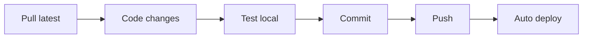

# 🚀 Hướng dẫn Cập nhật GitHub nhanh chóng

## 🎯 Tóm tắt nhanh

| Phương pháp | Độ khó | Tốc độ | Khuyến nghị |
|-------------|---------|---------|-------------|
| **GitHub Desktop** | ⭐ | ⭐⭐ | Người mới |
| **VS Code + Git** | ⭐⭐ | ⭐⭐⭐ | Khuyến nghị |
| **Command Line** | ⭐⭐⭐ | ⭐⭐⭐⭐ | Chuyên nghiệp |
| **Script tự động** | ⭐ | ⭐⭐⭐⭐⭐ | Tốt nhất |

---

## ⚡ QUICK START - Chỉ 3 bước

### **Bước 1: Clone repository lần đầu**
```bash
git clone https://github.com/louisngvn/me_va_be.git
cd me_va_be
```

### **Bước 2: Sử dụng script tự động**
```bash
# Windows: Double-click
quick-update.bat

# Mac/Linux: 
chmod +x quick-update.sh
./quick-update.sh
```

### **Bước 3: Chờ deploy**
- Website tự động cập nhật trong 1-2 phút
- Kiểm tra: https://louisngvn.github.io/me_va_be/

---

## 🛠️ Setup Chi Tiết

### **Option 1: GitHub Desktop (Đơn giản nhất)**

1. **Tải GitHub Desktop**: https://desktop.github.com/
2. **Clone repo**: 
   - File → Clone Repository 
   - URL: `https://github.com/louisngvn/me_va_be.git`
3. **Workflow hàng ngày**:
   - Sửa code trong folder local
   - Mở GitHub Desktop
   - Review changes → Commit → Push

### **Option 2: VS Code (Khuyến nghị)**

1. **Cài VS Code**: https://code.visualstudio.com/
2. **Extensions cần thiết**:
   ```
   - GitLens
   - Live Server  
   - Auto Rename Tag
   ```
3. **Clone repo**:
   - `Ctrl+Shift+P` → "Git: Clone"
   - URL: `https://github.com/louisngvn/me_va_be.git`
4. **Workflow**:
   - Source Control panel (`Ctrl+Shift+G`)
   - Stage → Commit → Sync

### **Option 3: Command Line (Nhanh nhất)**

```bash
# Setup lần đầu
git clone https://github.com/louisngvn/me_va_be.git
cd me_va_be
git config user.name "Your Name"
git config user.email "your@email.com"

# Workflow hàng ngày
git add .
git commit -m "Describe changes"
git push origin main
```

---

## 🔄 Workflow Khuyến nghị

### **Quy trình hàng ngày:**



### **Chi tiết từng bước:**

#### **1. Bắt đầu ngày làm việc**
```bash
git pull origin main  # Đồng bộ code mới nhất
```

#### **2. Phát triển tính năng**
```bash
# Test local server
python -m http.server 8000
# Hoặc với VS Code Live Server
```

#### **3. Commit thường xuyên**
```bash
# Mỗi tính năng nhỏ hoàn thành
git add .
git commit -m "Add flip card animation"
```

#### **4. Push cuối ngày**
```bash
git push origin main
```

---

## 🚨 Xử lý lỗi thường gặp

### **Lỗi: "Permission denied"**
```bash
# Cập nhật SSH key hoặc dùng HTTPS
git remote set-url origin https://github.com/louisngvn/me_va_be.git
```

### **Lỗi: "Merge conflict"**
```bash
# Pull trước khi push
git pull origin main
# Resolve conflicts manually
git add .
git commit -m "Resolve conflicts"
git push origin main
```

### **Lỗi: "Repository not found"**
```bash
# Kiểm tra tên repository và quyền truy cập
git remote -v
```

---

## 🎯 Tips Tối ưu hóa

### **1. Commit Messages hay**
```bash
✅ Tốt:
git commit -m "Add affiliate link system for all categories"
git commit -m "Fix flip card animation on mobile"
git commit -m "Update README with new features"

❌ Tránh:
git commit -m "fix"
git commit -m "update"
git commit -m "asdasd"
```

### **2. Gitignore cho dự án**
Tạo file `.gitignore`:
```
# Development
node_modules/
.env
*.log

# OS
.DS_Store
Thumbs.db

# Editor
.vscode/settings.json
*.swp
```

### **3. Branches cho tính năng lớn**
```bash
# Tạo branch mới cho tính năng
git checkout -b feature/affiliate-system
# Làm việc...
git add .
git commit -m "Complete affiliate system"
# Push branch
git push origin feature/affiliate-system
# Tạo Pull Request trên GitHub
```

---

## 🔧 Automation Scripts

### **Auto-deploy khi có thay đổi**
Tạo file `.github/workflows/auto-deploy.yml`:

```yaml
name: Auto Deploy
on:
  push:
    branches: [main]

jobs:
  deploy:
    runs-on: ubuntu-latest
    steps:
    - uses: actions/checkout@v3
    - name: Deploy to GitHub Pages
      run: echo "Deployed successfully! 🚀"
```

### **Backup tự động**
Script để backup sang Google Drive hoặc Dropbox:

```bash
#!/bin/bash
# backup.sh
TODAY=$(date +%Y%m%d)
tar -czf "backup_$TODAY.tar.gz" .
# Upload to cloud storage
echo "Backup created: backup_$TODAY.tar.gz"
```

---

## 📊 Monitoring & Analytics

### **Kiểm tra deploy status**
- GitHub Actions: `https://github.com/louisngvn/me_va_be/actions`
- GitHub Pages settings: Repository → Settings → Pages

### **Website performance**
- Google PageSpeed: https://pagespeed.web.dev/
- GTmetrix: https://gtmetrix.com/

---

## 🎖️ Best Practices

1. **📝 Commit thường xuyên** (mỗi tính năng nhỏ)
2. **🧪 Test trước khi push** (local testing)
3. **📋 Write meaningful commits** 
4. **🔄 Pull before push** (tránh conflicts)
5. **🔒 Backup important work** (multiple copies)
6. **📈 Monitor deployment** (check Actions tab)
7. **🎯 Use branches** cho tính năng lớn
8. **📚 Document changes** (update README)

---

**💡 Pro tip**: Bookmark các URL quan trọng
- Repository: https://github.com/louisngvn/me_va_be
- Live website: https://louisngvn.github.io/me_va_be/
- Actions: https://github.com/louisngvn/me_va_be/actions